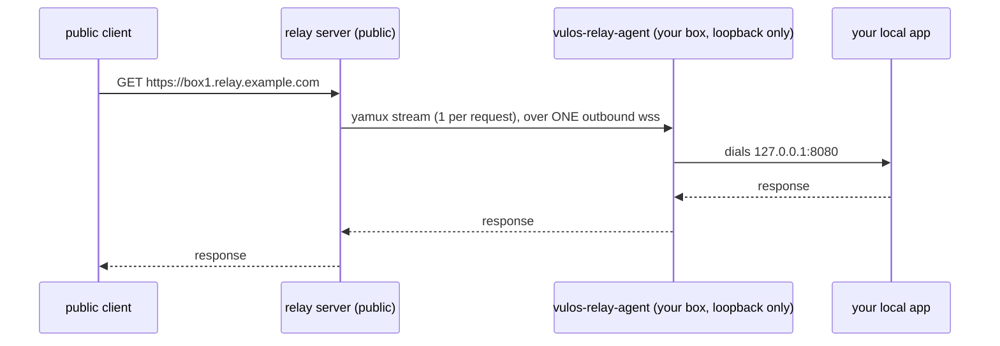

# Getting Started

This guide takes you from zero to a publicly reachable Vulos box: you will run (or point at) a relay server, authorize an agent, expose a local service, and verify the tunnel end to end. The reverse tunnel lets a loopback-bound box publish itself on the public internet with **no inbound ports, no static IP, and no third-party tunnel service** — the box's agent dials one outbound `wss://` connection to a relay, and the relay reverse-proxies public HTTP + WebSocket traffic back down it. There are two paths through this guide: **self-hosted** (you run the relay server too — fully sovereign, no Vulos account required) and **Vulos-hosted** (you run only the agent, link it to a Vulos account, and use a relay operated for you).

> Looking for the JS/TS peer-fabric SDK (`@vulos/relay-client` — WebRTC data channels, presence, live cursors)? That is the repo's other deliverable; see the [README quick start](../README.md#quick-start-standalone), [CONFIGURATION.md](CONFIGURATION.md), and [`client/README.md`](../client/README.md). This chapter covers the Go reverse tunnel.

---

## What you are setting up



Two binaries, both in this repo:

| Binary | Runs where | Role |
|--------|-----------|------|
| `vulos-relayd` (`cmd/vulos-relayd`) | A public host you control (VPS, Fly.io, …) | Accepts agent connections, serves the public URLs |
| `vulos-relay-agent` (`cmd/vulos-relay-agent`) | The box, next to the service you expose | Dials out to the relay, forwards requests to one local port |

Only **outbound 443** is required from the box. The agent binds nothing inbound and forwards **only** to its one configured loopback target (SSRF guard — a non-loopback `-local` is refused at startup and re-checked on every request).

---

## Prerequisites

- **Go 1.25+** to build from source, **or** Docker (the published image `ghcr.io/vul-os/vulos-relayd` bundles both binaries).
- For a self-hosted relay: a public host, a domain, and one of:
  - **Subdomain mode (primary):** wildcard DNS `*.relay.example.com` → your relay host, plus a wildcard TLS cert (trivial behind an ACME edge/CDN).
  - **Path mode (fallback):** just `relay.example.com` → your relay host; tunnels are served at `https://relay.example.com/t/<name>/`. Enable with `-path-mode`.
- TLS: either terminate at a fronting edge/CDN (recommended; run the relay as plain HTTP on a private port) or hand the relay `-cert`/`-key` to terminate itself.

Build both binaries:

```bash
go build -o vulos-relayd      ./cmd/vulos-relayd
go build -o vulos-relay-agent ./cmd/vulos-relay-agent
```

Or with Docker (the image's entrypoint is the server; override it for the agent):

```bash
docker pull ghcr.io/vul-os/vulos-relayd:latest
# server: docker run ... ghcr.io/vul-os/vulos-relayd
# agent:  docker run ... --entrypoint /usr/local/bin/vulos-relay-agent ghcr.io/vul-os/vulos-relayd ...
```

---

## Path A — self-hosted relay (sovereign, no Vulos account)

### A1. Create an agent grant

The relay refuses to run "open": it requires a token store. The simplest is a static grants file — a JSON array of `{token, names}` entries. A token may serve **only** the names it is granted.

```bash
# grants.json — keep this file secret; tokens are bearer credentials.
cat > grants.json <<'EOF'
[
  {"token": "REPLACE-WITH-A-LONG-RANDOM-SECRET", "names": ["box1"]}
]
EOF
```

Generate a strong token, e.g. `openssl rand -hex 32`. Names must be DNS-label-safe: lowercase `a-z0-9-`, max 63 chars, no leading/trailing hyphen — `box1` becomes `https://box1.relay.example.com`.

Optional grant fields (see [`tunnel/server/auth.go`](../tunnel/server/auth.go)):

- `"account_id"` — links the token to a Vulos account for metering/gating (Path B territory; omit for pure self-host).
- `"expires_at"` (RFC 3339) — the grant stops authorizing after this time (fail-closed self-revocation for leaked tokens).
- `"previous_token"` — the old secret accepted alongside `token` during a rotation window, so agents roll to a new token without a flag day.

You can also pass the grants inline via the `VULOS_RELAY_TOKENS` environment variable instead of a file.

### A2. Run the relay server

Behind a TLS-terminating edge/CDN (recommended — the Fly.io deployment in [`fly.toml`](../fly.toml) is this shape):

```bash
./vulos-relayd -addr :8443 -domain relay.example.com -tokens-file grants.json
```

Terminating TLS in-process instead:

```bash
./vulos-relayd -addr :443 -domain relay.example.com \
  -cert /etc/tls/fullchain.pem -key /etc/tls/privkey.pem \
  -tokens-file grants.json
```

No wildcard DNS? Add `-path-mode` and use `https://relay.example.com/t/box1/`.

Two flags to get right on day one:

- `-trust-proxy-headers` (env `VULOS_RELAY_TRUST_PROXY_HEADERS=1`): **leave it off** when the relay is directly internet-facing (default; the relay overwrites `X-Forwarded-For` so clients cannot spoof their IP). **Turn it on only** when a trusted TLS-terminating proxy fronts the relay (Fly's proxy does; `fly.toml` sets it).
- `-admin-addr` (default `127.0.0.1:9090`): the separate admin listener serving `/metrics`, `/healthz`, `/readyz`. Keep it loopback-bound; a routable bind requires `-metrics-token` or the server refuses to start.

The full flag/env reference (rate limits, revocation, request-size cap, billing) is in [TUNNEL.md](TUNNEL.md#flags--env); the deep-dive on behavior is [TUNNEL-GUIDE.md](TUNNEL-GUIDE.md).

### A3. Set up DNS

- **Subdomain mode:** `relay.example.com` **and** `*.relay.example.com` → your relay host (A/AAAA or CNAME). TLS needs a `*.relay.example.com` cert at whatever terminates TLS.
- **Path mode:** just `relay.example.com` → your relay host.

### A4. Run the agent on the box

```bash
./vulos-relay-agent \
  -server wss://relay.example.com \
  -token  REPLACE-WITH-A-LONG-RANDOM-SECRET \
  -name   box1 \
  -local  127.0.0.1:8080
```

Every flag has an env-var twin so the token never has to appear in `ps` output: `VULOS_RELAY_SERVER`, `VULOS_RELAY_TOKEN`, `VULOS_RELAY_NAME` (and `VULOS_RELAY_DIRECT_ENDPOINT` for `-direct`). `-local` defaults to `127.0.0.1:8080` and **must** be a loopback address.

On success the agent logs:

```
connected: https://box1.relay.example.com
```

The agent maintains the tunnel itself: it reconnects after any drop with exponential backoff + full jitter (500 ms doubling, capped at 30 s). You do not need a supervisor loop, though running it under systemd/Docker for boot persistence is sensible.

### A5. Optional: advertise a direct fast path

If the box *also* has a public IP or hostname with its own TLS listener, tell the relay:

```bash
./vulos-relay-agent -server wss://relay.example.com -token ... -name box1 \
  -local 127.0.0.1:8080 -direct https://box1.example.com
```

The relay **verifies** the endpoint before advertising it (it must be reachable from the internet and echo a one-time nonce from `GET /_vulos-direct/probe` — ownership proof, so nobody can advertise your IP). Clients then dial the box directly and fall back to the relay on failure. Verification failure is non-fatal: the tunnel still comes up relay-only. Details: [TUNNEL-GUIDE.md](TUNNEL-GUIDE.md#direct-first-relay-fallback).

---

## Path B — Vulos-hosted relay (account-linked)

Here someone else (Vulos Cloud, or any operator running `vulos-relayd` with the control-plane integration) runs the relay; you run only the agent, and your usage is metered against your Vulos account's tier. See [METERING-BILLING.md](METERING-BILLING.md) for tiers and quotas.

### B1. Link the install to your account (device-code flow)

The control plane mints an **install credential** — an opaque, account-bound bearer token — via a headless device-code flow (endpoints served by Vulos Cloud, not by the relay):

1. The install `POST`s `{cp}/api/link/device/start` → `{device_code, user_code, verification_url, interval, expires_in}`.
2. You open `verification_url` in a browser, sign in to your Vulos account, and enter the `user_code` (this hits `POST {cp}/api/link/device/approve`).
3. The install polls `POST {cp}/api/link/device/poll` with the `device_code` — `428` while pending, then `{install_credential, account_id}` once approved. The credential is issued exactly once (a second poll gets `410`).

Inside VulOS this flow is driven for you by the OS; a standalone agent install can drive it with three `curl` calls.

### B2. Run the agent with the install credential

Against a relay running the CP-backed token store (`-cp-token-store`), the install credential **is** your agent token:

```bash
VULOS_RELAY_TOKEN='<install_credential>' \
./vulos-relay-agent -server wss://<relay-host> -name <your-name> -local 127.0.0.1:8080
```

With the CP token store, any valid (DNS-label-safe) name is accepted for a validated account — name uniqueness is still first-come, first-held on the live relay, so pick something distinctive.

### B3. What linking changes

- **Connect gate (fail-closed):** the relay checks `GET {cp}/api/relay/entitlement` before serving your tunnel. A denied, over-quota, revoked, or un-vettable account is refused at connect.
- **Metering:** bytes and sessions through the relay are flushed to `POST {cp}/api/relay/usage` against your account.
- **Mid-session (fail-open):** a transient control-plane blip never cuts a live tunnel; a definitive over-quota or revoke verdict does (over-quota returns `402` on your next request).

A static grant with **no** `account_id`, on an unbilled relay, is served with none of this — pure self-host needs no Vulos account.

### For operators: hosting the linked relay yourself

To run the account-linked relay tier yourself, give `vulos-relayd` the control-plane wiring:

```bash
./vulos-relayd -domain relay.example.com \
  -cp-url https://cloud.vulos.dev \
  -cp-shared-secret "$CP_SHARED_SECRET" \
  -pop-id relay-eu-1 \
  -cp-token-store        # agent tokens ARE CP install credentials
```

Without `-cp-token-store` you can also mix modes: keep a static grants file and link individual grants by setting their `account_id`. Omit `-cp-url`/`-cp-shared-secret` entirely to run unbilled.

---

## Verify the tunnel

1. **Relay liveness** (public listener, any Host):

   ```bash
   curl https://relay.example.com/healthz
   # ok agents=1
   ```

2. **The public URL reaches your local app:**

   ```bash
   curl -i https://box1.relay.example.com/        # subdomain mode
   curl -i https://relay.example.com/t/box1/      # path mode (-path-mode)
   ```

   You should see your app's response, not a relay error. `404 no such tunnel` means routing didn't match a name; `502 tunnel offline` means the name is known-shaped but no agent session holds it. See [TROUBLESHOOTING.md](TROUBLESHOOTING.md).

3. **WebSockets pass through:** connect any WS client to `wss://box1.relay.example.com/<your-ws-path>` — upgrades are spliced transparently.

4. **Direct fast path (if advertised):**

   ```bash
   curl https://box1.relay.example.com/_vulos-direct/resolve
   # {"name":"box1","directEndpoint":"https://box1.example.com","direct":true}
   # or {"name":"box1","direct":false} when relay-only
   ```

5. **Agent status:** the CLI logs status transitions (`starting` → `connected`, or `error: <reason>`). Embedded agents expose the same via `Snapshot()` — status, public URL, last error, a bounded in-memory log, and the direct-endpoint verdict.

6. **Server metrics** (from the relay host itself):

   ```bash
   curl http://127.0.0.1:9090/metrics | grep vulos_relay_active_agents
   ```

---

## Embedding the agent in your own Go program

The CLI is a thin wrapper over the `tunnel/agent` library, which mirrors wede's `internal/tunnel.Manager` surface:

```go
import "github.com/vul-os/vulos-relay/tunnel/agent"

a := agent.New(agent.Options{
    ServerURL: "wss://relay.example.com", // http/https are normalized to ws/wss
    Token:     os.Getenv("VULOS_RELAY_TOKEN"),
    Name:      "box1",
    LocalAddr: "127.0.0.1:8080",          // must be loopback (SSRF guard)
})
if err := a.Start(ctx); err != nil { /* bad options */ }
url  := a.PublicURL()  // "" until connected
snap := a.Snapshot()   // Status, PublicURL, Connected, LastError, Log, Direct*
a.Stop()               // frees the name immediately
```

`Options` also accepts `TLSConfig` (pin a CA for a self-hosted relay), `DirectEndpoint`, `HandshakeTimeout` (default 15 s), and `MaxBackoff` (default 30 s). `Snapshot()` never includes the token.

---

## Where to next

| Topic | Chapter |
|-------|---------|
| Protocol, lifecycle, multiplexing, direct-vs-relay in depth | [TUNNEL-GUIDE.md](TUNNEL-GUIDE.md) |
| Trust model — what the relay can and cannot see | [SECURITY.md](SECURITY.md) |
| Metering, tiers, quotas, over-quota behavior | [METERING-BILLING.md](METERING-BILLING.md) |
| Symptoms → cause → fix | [TROUBLESHOOTING.md](TROUBLESHOOTING.md) |
| Full server flag/env reference + deploy notes | [TUNNEL.md](TUNNEL.md) |
